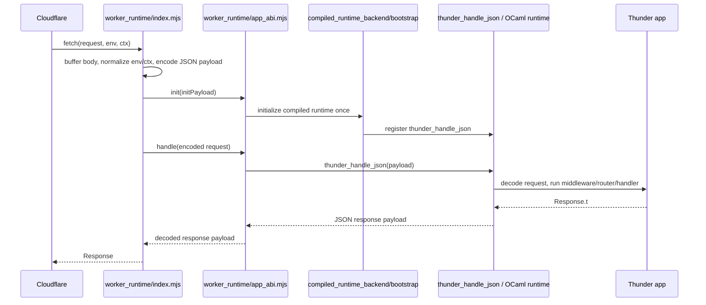

# Thunder Architecture

This document describes the current Thunder architecture as it exists in the repository today.

Thunder's job is to let an application be written in OCaml, compile that application into a JS or Wasm runtime bundle, and package that bundle so it can execute behind a thin Cloudflare Worker host.

This is a current-state document. It intentionally does not describe older architecture shapes, abandoned runtime paths, or historical migration plans.

## What Thunder builds

At a high level, Thunder produces a Worker deployment made of four layers:

1. **Application code** written against the Thunder API.
2. **Framework runtime code** in OCaml that decodes Worker requests, runs the app, and encodes responses.
3. **Worker-side JavaScript modules** that host the compiled runtime inside Cloudflare's module Worker environment.
4. **Deployment packaging** that stages the exact runtime files Wrangler should upload.

The result is a Cloudflare Worker whose `fetch(request, env, ctx)` entrypoint is JavaScript, but whose application behavior is implemented by compiled OCaml code running behind a Thunder-owned ABI.

## Major components

### OCaml framework packages

- `packages/thunder_core`
  - Provides typed context storage used to attach framework and Worker-specific state to requests.
- `packages/thunder_http`
  - Defines the public HTTP programming model: methods, status codes, headers, cookies, query parsing, requests, responses, handlers, and middleware.
- `packages/thunder_router`
  - Parses route patterns, matches incoming requests, binds params, and dispatches to the winning handler.
- `packages/thunder_worker`
  - Owns the Worker-specific runtime boundary on the OCaml side.
  - Decodes ABI payloads into Thunder requests.
  - Stores Worker env and execution-context features in request context.
  - Exports the compiled app entrypoint as `globalThis.thunder_handle_json`.
- `packages/thunder_cli`
  - Owns artifact discovery, manifest parsing, deploy-tree staging, preview publishing, and production deploy orchestration.

### Worker runtime modules

The JavaScript runtime under `worker_runtime/` is the Cloudflare-facing side of the system.

- `worker_runtime/index.mjs`
  - The thin Worker host.
  - Receives `fetch(request, env, ctx)`.
  - Buffers the request.
  - Builds the ABI payload.
  - Calls into the Thunder ABI shim.
  - Reconstructs a real `Response` from the runtime result.
- `worker_runtime/app_abi.mjs`
  - The Thunder-owned runtime shim.
  - Normalizes init payloads.
  - Validates ABI version.
  - Initializes the runtime once.
  - Selects the compiled JS or Wasm backend from the manifest.
  - Forwards encoded request payloads to the selected runtime backend.
- `worker_runtime/compiled_js_runtime_backend.mjs`
  - Adapts the JS-compiled OCaml runtime to the ABI shim.
  - Loads the selected JS runtime module.
  - Invokes `globalThis.thunder_handle_json` without Wasm asset bootstrapping.
- `worker_runtime/compiled_runtime_backend.mjs`
  - Adapts the Wasm-compiled OCaml runtime to the ABI shim.
  - Ensures the Wasm runtime is bootstrapped.
  - Invokes `globalThis.thunder_handle_json`.
- `worker_runtime/compiled_runtime_bootstrap.mjs`
  - Loads the generated runtime module.
  - Intercepts Wasm asset loading.
  - Waits for the compiled runtime to register the global entrypoint.

### Build and packaging metadata

- `dist/worker/manifest.json`
  - Declares the deployable runtime artifact set.
  - Declares the selected runtime kind.
  - Is the source of truth for staging and hashing.
- `wrangler.toml`
  - The template for Worker deployment settings.
  - Thunder rewrites the staged copy so the staged Worker host is the deployed entrypoint.

## The application model

Thunder applications are plain handler graphs.

The public API exposed through `packages/thunder_http/thunder.mli` gives the app author a compact surface:

- `Thunder.handler` wraps a function from `Request.t -> Response.t`.
- `Thunder.get`, `Thunder.post`, `Thunder.put`, `Thunder.patch`, and `Thunder.delete` construct routes.
- `Thunder.router` converts a route list into a single handler.
- `Thunder.Middleware` composes handler transformations around that app handler.

In generated apps, the application normally lives under `app/` and is exported from `worker/entry.ml` as a tiny wrapper around the real app:

```ocaml
let app = My_app.Routes.app |> My_app.Middleware.apply

let () = Entry.export app
```

Inside this repository, the same architecture is currently dogfooded through:

- `packages/thunder_worker/dogfood_app.ml`
- `packages/thunder_worker/wasm_entry.ml`

That repo-local dogfood entrypoint is not a separate architecture. It is the same runtime shape wired to an app that happens to live inside the framework repo.

## Core OCaml execution model

### Requests

`packages/thunder_http/request.ml` defines `Request.t` as a fully buffered request value containing:

- HTTP method
- full URL
- parsed path
- normalized headers
- parsed query params
- parsed cookies
- route params
- buffered body as a string
- a typed context map

Two details matter for understanding the runtime:

1. Thunder is currently a buffered runtime.
   - Request bodies are read completely before OCaml sees them.
2. Worker-specific state is not baked into `Request.t` directly.
   - It is attached through the typed context map from `thunder_core`.

### Responses

`packages/thunder_http/response.ml` defines `Response.t` as:

- status
- headers
- buffered body string

Thunder currently returns buffered responses only. There is no streaming response path in the ABI.

### Middleware

`packages/thunder_http/middleware.ml` defines middleware as `Handler.t -> Handler.t`.

That means middleware is not a special runtime concept. It is simply handler transformation. The framework ships a few core examples:

- `recover`
  - catches exceptions and returns a `500`
- `logger`
  - logs the method and path before delegating

Middleware composition is a pure OCaml concern and happens before any Worker-specific encoding back to JavaScript.

### Routing

`packages/thunder_router/router.ml` builds a handler from a list of routes.

The router:

- splits patterns into static and parameter segments
- matches method first
- matches path segment count exactly
- extracts `:param` values into request params
- scores candidates by number of static segments
- selects the most specific matching route
- returns `404 Not Found` when no route matches

This means route dispatch is fully resolved inside OCaml after the Worker request has already crossed the ABI boundary.

### Worker data inside requests

`packages/thunder_worker/worker.ml` introduces two context keys:

- one for Worker env bindings
- one for Worker execution-context capabilities

The runtime uses those keys to attach Worker information onto each request. App code can then read:

- `Worker.env req`
- `Worker.env_binding env "NAME"`
- `Worker.ctx req`
- `Worker.ctx_has_feature ctx "waitUntil"`

This is important because Thunder does not pass raw Worker host objects into OCaml. It passes a normalized, framework-owned representation.

## The runtime boundary

Thunder's current Worker boundary is a Thunder-owned JSON ABI.

The JavaScript host and the OCaml runtime do not call each other using ad hoc compiler globals or direct Cloudflare APIs. They communicate through a versioned JSON payload contract that Thunder defines and controls.

### Request payload shape

`worker_runtime/index.mjs` encodes each incoming request into a JSON payload with these fields:

- `v`
  - ABI request version, currently `1`
- `method`
  - HTTP method string
- `url`
  - full request URL
- `headers`
  - list of header tuples
- `body`
  - decoded text body
- `body_base64`
  - base64 form of the buffered body for binary-safe transfer
- `env_bindings`
  - serializable Worker env values as string pairs
- `ctx_features`
  - recognized execution-context capabilities

The host currently serializes env bindings only when the values are strings, numbers, or booleans. Non-serializable bindings are ignored at this boundary.

The host currently serializes execution context as feature flags, not as executable callbacks. Today the recognized features are:

- `waitUntil`
- `passThroughOnException`

### Response payload shape

The OCaml side returns JSON containing:

- `status`
- `headers`
- `body`

The JavaScript host also supports `body_base64` when reconstructing a `Response`, but the current OCaml encoder in `packages/thunder_worker/entry.ml` emits `body` as a string.

### Why the ABI exists

The ABI gives Thunder a stable framework-owned contract between:

- the Cloudflare-facing Worker host
- the compiled OCaml runtime bundle

That separation matters because it lets Thunder evolve the compiler output and runtime internals without making the Worker host itself responsible for app semantics.

## Request lifecycle

The full request path through the current system is:

### Sequence diagram



1. **Cloudflare invokes the module Worker host**
   - `worker_runtime/index.mjs` receives `fetch(request, env, ctx)`.

2. **The host buffers and encodes the request**
   - It iterates headers.
   - It reads the entire request body into an `ArrayBuffer`.
   - It creates both text and base64 body representations.
   - It extracts serializable env bindings.
   - It records supported context features.

3. **The host initializes the ABI shim**
   - `initAppAbi({ initPayload })` is called before handling the request.
   - The current init payload is minimal and empty on the host side.
   - `worker_runtime/app_abi.mjs` fills defaults from `dist/worker/manifest.json`.

4. **The ABI shim resolves the runtime backend**
   - In normal production use, the backend is `compiled-runtime`.
   - The only alternate path is a test override through `globalThis.__THUNDER_WASM_SHIM__`.
   - That override exists for tests; it is not a second supported production architecture.

5. **The compiled runtime is bootstrapped**
   - `worker_runtime/compiled_runtime_bootstrap.mjs` imports `../dist/worker/thunder_runtime.mjs`.
   - It also intercepts Wasm asset loading so the generated runtime can resolve `.wasm` chunks from the bundled asset map.
   - Initialization is considered successful only after `globalThis.thunder_handle_json` has been registered.

6. **The encoded request crosses into OCaml**
   - `worker_runtime/compiled_runtime_backend.mjs` calls `globalThis.thunder_handle_json(jsonPayload)`.

7. **The OCaml entrypoint decodes the request**
   - `packages/thunder_worker/entry.ml` parses the JSON.
   - It validates the ABI request version.
   - It decodes `body` or falls back to `body_base64`.
   - It constructs `Runtime.decoded_request`.

8. **Thunder constructs a framework request**
   - `packages/thunder_worker/runtime.ml` converts the decoded request into `Request.t`.
   - It parses the HTTP method string into `Method.t`.
   - It normalizes headers.
   - It attaches Worker env and ctx data to request context.
   - Invalid methods become explicit `400` responses.

9. **The app runs entirely in OCaml**
   - Middleware wraps the app handler.
   - The router chooses a route.
   - The handler returns a `Response.t`.
   - Exceptions can be converted to `500`s by middleware such as `recover`.

10. **The OCaml runtime encodes the response**
    - `Runtime.encode_response` produces status, headers, and body.
    - `Entry.handle_json` converts that value into JSON text.

11. **The Worker host reconstructs a real `Response`**
    - `worker_runtime/index.mjs` parses the payload.
    - It appends headers to preserve repeated response headers such as `set-cookie`.
    - It returns the final `Response` to Cloudflare.

12. **Failures are turned into explicit Worker responses**
    - Initialization failures become `500` text responses saying runtime initialization failed.
    - Runtime invocation or malformed payload failures become `500` text responses saying runtime invocation failed.

## Build pipeline

Thunder's build pipeline is defined by Dune and produces a deployable runtime tree in stages.

### 1. Compile the app entrypoint to the runtime bundle

In this repository, the root `dune` file defines the `worker-build` alias.

The key step is:

- `packages/thunder_worker/wasm_entry.bc`
  -> `wasm_of_ocaml compile`
  -> `dist/worker/thunder_runtime.mjs`
  plus `dist/worker/thunder_runtime.assets/*.wasm`

That output is the compiled OCaml application and framework runtime.

In a generated app, the same shape exists, but the input bytecode comes from the app's own `worker/entry.ml` executable instead of the repo's dogfood entrypoint.

### 2. Generate the Wasm asset map

The root `dune` file also generates:

- `worker_runtime/generated_wasm_assets.mjs`

This file is created by `scripts/generate_wasm_asset_map.py` from the generated `.wasm` chunks in `dist/worker/thunder_runtime.assets/`.

Its role is to let the bootstrap/runtime backend satisfy Wasm loads in the Worker environment.

### 3. Produce the runtime manifest

`dist/worker/manifest.json` defines the package layout for deployment.

Today it names:

- the Worker host entry module
- the ABI shim
- the generated Wasm asset map
- the compiled runtime backend
- the bootstrap module
- the compiled runtime module
- the runtime asset directory

This manifest is not just documentation. Thunder uses it operationally during hashing, staging, and deployment.

## Runtime initialization

`worker_runtime/app_abi.mjs` is responsible for one-time runtime initialization.

### Init behavior

The ABI shim computes a normalized init payload from:

- explicit host-supplied init data
- defaults from `dist/worker/manifest.json`

The normalized init result includes:

- `abi_version`
- `app_id`
- `asset_base_url`
- `capabilities`
- `backend_kind`

The current capability set advertised by the shim is:

- `json_request_payload`
- `json_response_payload`
- `buffered_body`
- `env_bindings`
- `ctx_features`

### Backend selection

The current production architecture has a single supported backend:

- `compiled-runtime`

The shim can prefer `globalThis.__THUNDER_WASM_SHIM__` if present, but that exists to make runtime tests deterministic. The actual framework runtime path is the compiled runtime backend.

### Bootstrap behavior

`worker_runtime/compiled_runtime_bootstrap.mjs` performs the critical setup needed by the generated runtime module:

- synthesizes `document.currentScript` when needed
- clears `process` assumptions that do not belong in the Worker runtime
- patches `fetch` so runtime Wasm asset requests can be served from bundled assets
- patches `WebAssembly.instantiateStreaming` when needed
- imports the compiled runtime module
- waits for global registration of `thunder_handle_json`

The bootstrap layer is what turns the compiler output into a predictable Thunder runtime inside the Worker environment.

## Deployment architecture

Thunder does not deploy directly from the raw build outputs. It stages a deploy-ready Worker tree first.

### Manifest-driven staging

`packages/thunder_cli/deploy_manifest.ml` parses `dist/worker/manifest.json` and resolves every referenced file path.

`packages/thunder_cli/deploy_layout.ml` then copies those artifacts into the deploy tree, typically under `_build/default/deploy/` during a Dune-driven build.

The staged tree includes:

- `dist/worker/manifest.json`
- `worker_runtime/index.mjs`
- `worker_runtime/app_abi.mjs`
- `worker_runtime/generated_wasm_assets.mjs`
- `worker_runtime/compiled_runtime_backend.mjs`
- `worker_runtime/compiled_runtime_bootstrap.mjs`
- `dist/worker/thunder_runtime.mjs`
- `dist/worker/thunder_runtime.assets/`
- a rewritten `wrangler.toml`

The staged Wrangler config is rendered so that:

- `main = "worker_runtime/index.mjs"`
- `find_additional_modules = true`

That ensures the deployed Worker entrypoint is the Thunder host, not the compiled runtime module directly.

### Preview publish flow

Preview publishing is orchestrated by `packages/thunder_cli/preview_publish.ml`.

The flow is:

1. Resolve the manifest's referenced files.
2. Verify the runtime artifacts exist.
3. Compute a stable artifact hash over the manifest and referenced artifacts.
4. Stage the deploy tree.
5. Compare the new hash with `.thunder/preview.json`.
6. Skip upload if unchanged, unless forced.
7. If credentials and Wrangler are available, upload a preview Worker.
8. Persist metadata such as artifact hash, upload time, version id, preview URL, and raw Wrangler output.

This means preview publish is content-aware and manifest-driven, not just a blind upload of whatever happens to exist in the repository.

### Production deploy flow

Production deployment is orchestrated by `packages/thunder_cli/deploy_prod.ml`.

It uses the same staging logic as preview publish, but requires:

- `CONFIRM_PROD_DEPLOY=1`

If that guard is missing, production deploy fails safely.

Once staged, Thunder invokes Wrangler against the staged config, not the root template.

## Generated apps versus the framework repo

Thunder is designed so generated apps are the product shape and the framework repo is only one consumer of that shape.

### Generated apps

`packages/thunder_cli/scaffold.ml` creates a generated app with:

- `app/` for app routes and middleware
- `worker/entry.ml` for the tiny export wrapper
- local `dune` rules that build `dist/worker/` outputs
- local `worker_runtime/generated_wasm_assets.mjs`
- preview and deploy aliases wired to the Thunder CLI

Generated apps currently vendor or link framework internals under `vendor/thunder-framework` so they can build and deploy using the framework-owned runtime assets and CLI.

That vendoring detail is part of the current architecture because it is how generated apps resolve framework-owned deploy/runtime pieces today.

### The framework repo dogfood path

This repository still deploys the app rooted at:

- `packages/thunder_worker/dogfood_app.ml`
- `packages/thunder_worker/wasm_entry.ml`

That is a repository-layout difference, not a runtime-architecture difference. The Worker host, ABI shim, compiled runtime bootstrap, manifest-driven staging, and Wrangler deploy flow are the same ideas used by generated apps.

## Current constraints and invariants

The current Thunder architecture depends on several intentional constraints.

### Buffered I/O only

Thunder currently buffers request and response bodies at the JS-to-OCaml boundary.

- Request bodies are fully read before the app runs.
- Responses are returned as full payloads.
- No streaming ABI is exposed.

### JSON ABI only

The JS host and OCaml runtime communicate through JSON payloads.

That keeps the runtime boundary explicit, testable, and debuggable, at the cost of buffering and serialization overhead.

### Restricted Worker host data in OCaml

Worker env and execution context are intentionally normalized before they cross the ABI boundary.

- env bindings are reduced to serializable string pairs
- execution context is reduced to feature names

Thunder apps therefore depend on Thunder's Worker abstraction, not direct Cloudflare runtime objects.

### Single supported runtime path

Thunder currently supports one runtime backend shape in production:

- the compiled runtime backend behind `worker_runtime/app_abi.mjs`

The runtime tests include a shim override, but the framework architecture is centered on the compiled runtime path.

### Manifest as source of truth

The deploy manifest is an operational part of the system.

Thunder uses it to:

- discover deployable runtime files
- compute artifact hashes
- stage the deploy tree
- keep preview and production packaging aligned

## End-to-end summary

Putting the pieces together, the current Thunder architecture works like this:

1. The app is written as Thunder handlers, routes, and middleware in OCaml.
2. A tiny entry module exports that app through `Entry.export`.
3. `wasm_of_ocaml` compiles that entrypoint into `dist/worker/thunder_runtime.mjs` plus Wasm assets.
4. Thunder generates a manifest and Wasm asset map describing how the runtime should be loaded.
5. A thin Worker host in `worker_runtime/index.mjs` receives Cloudflare requests.
6. The host serializes the request into Thunder's JSON ABI.
7. The ABI shim initializes and invokes the compiled runtime.
8. The compiled runtime calls the exported OCaml handler entrypoint.
9. The app runs entirely inside Thunder's OCaml request/response/middleware/router model.
10. The runtime encodes the response back into JSON.
11. The Worker host reconstructs a real `Response` and returns it to Cloudflare.
12. Thunder stages that complete runtime tree and deploys it through Wrangler using manifest-driven packaging.

That is the current architecture Thunder uses to compile apps to run on a Cloudflare Worker.
